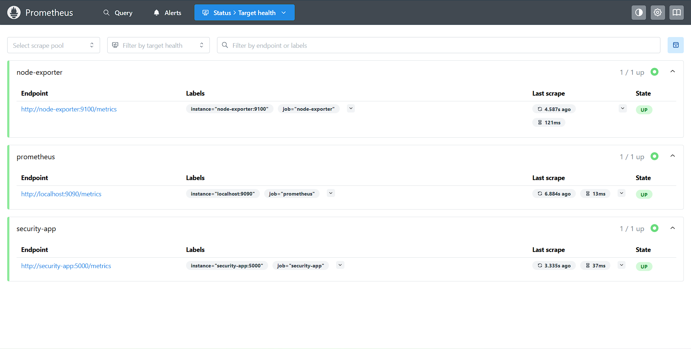
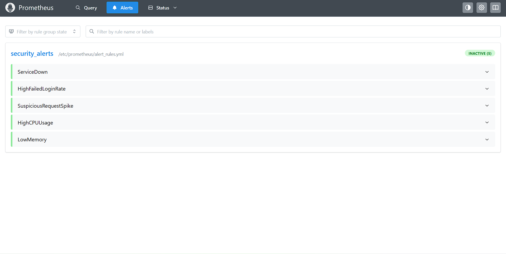
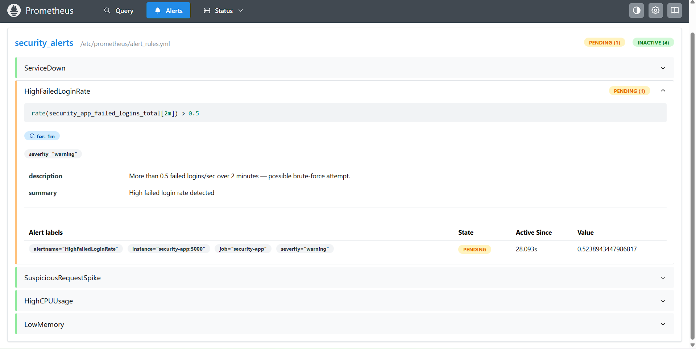
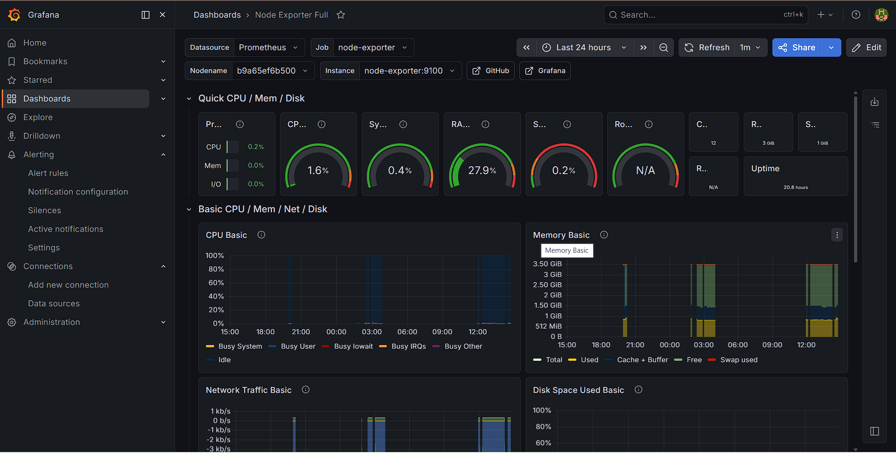

# Security Monitoring Dashboard

A local security observability stack built with **Prometheus**, **Grafana**, and **Alertmanager** — monitoring a security-instrumented Python Flask application alongside host system metrics.

## What This Does

- **Prometheus** scrapes metrics every 15s from the Flask app and the host system
- **Grafana** visualizes them in real-time dashboards
- **Alertmanager** routes alerts when thresholds are breached
- **Flask app** simulates a security-instrumented service exposing:
  - Failed login counters (brute-force detection signal)
  - Suspicious request tracking
  - Active session gauge
  - Request latency histogram

## Stack

| Component | Purpose | Port |
|---|---|---|
| Prometheus | Metric collection & alerting | 9090 |
| Grafana | Dashboards & visualization | 3001 |
| Alertmanager | Alert routing | 9093 |
| Node Exporter | Host system metrics | 9100 |
| Flask App | Simulated security service | 5000 |

## Quick Start

**Prerequisites:** Docker Desktop installed and running.

```bash
# 1. Clone the repo
git clone https://github.com/AroraTheGreat/security-monitoring-dashboard.git
cd security-monitoring-dashboard

# 2. Start the stack
docker compose up --build -d

# 3. Open the services
# Grafana:      http://localhost:3001  (admin / admin)
# Prometheus:   http://localhost:9090
# Alertmanager: http://localhost:9093
# App metrics:  http://localhost:5000/metrics
```

## Setting Up Grafana Dashboards

1. Open **http://localhost:3001** → login with `admin / admin`
2. Go to **Dashboards → Import**
3. Import dashboard ID **1860** (Node Exporter Full) for host metrics
4. Create a new dashboard and add panels using these queries:

```promql
# Failed login rate (brute-force signal)
rate(security_app_failed_logins_total[2m])

# Active sessions
security_app_active_sessions

# Request latency (95th percentile)
histogram_quantile(0.95, rate(security_app_request_latency_seconds_bucket[5m]))

# Suspicious request rate
rate(security_app_suspicious_requests_total[1m])
```

## Testing the Alert Pipeline

Trigger a simulated brute-force attack:

```bash
curl http://localhost:5000/simulate/attack
```

Then check:
- **http://localhost:9090/alerts** — see alerts firing in Prometheus
- **http://localhost:9093** — see alerts routed in Alertmanager

## Alert Rules

| Alert | Condition | Severity |
|---|---|---|
| ServiceDown | App unreachable > 30s | Critical |
| HighFailedLoginRate | > 0.5 failed logins/sec over 2m | Warning |
| SuspiciousRequestSpike | > 1 suspicious req/sec over 30s | Warning |
| HighCPUUsage | CPU > 80% for 2m | Warning |
| LowMemory | Available memory < 20% for 2m | Warning |

## Stopping the Stack

```bash
docker compose down
```

## Project Structure

```
security-monitoring-dashboard/
├── docker-compose.yml
├── prometheus/
│   ├── prometheus.yml        # Scrape config
│   └── alert_rules.yml       # Alert definitions
├── alertmanager/
│   └── alertmanager.yml      # Alert routing
├── app/
│   ├── app.py                # Flask app with Prometheus instrumentation
│   ├── requirements.txt
│   └── Dockerfile
└── grafana/
    └── provisioning/
        └── datasources/
            └── prometheus.yml
```

## Screenshots

### Prometheus - All Targets UP


### Alert Rules Loaded


### HighFailedLoginRate Alert FIRING


### Grafana - Node Exporter Dashboard
